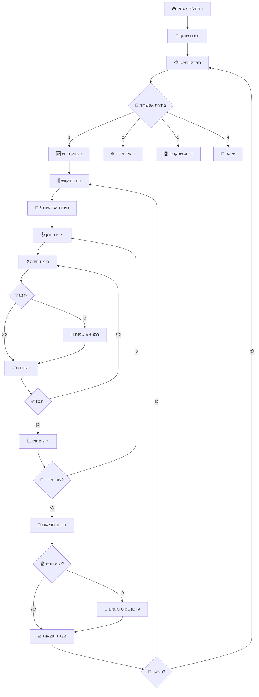

# 🧩 משחק החידות המתקדם

משחק חידות אינטראקטיבי מבוסס Node.js עם ארכיטקטורה client-server, מערכת ניהול שחקנים, וממשק CRUD מלא לניהול חידות.

## 🎯 תיאור הפרויקט

פרויקט החידות הוא משחק קונסולה מתקדם הבנוי עם JavaScript/Node.js עם הפרדה בין client ו-server. המשחק כולל:

- **🧮 חידות מתמטיות** בשלוש רמות קושי (קל, בינוני, קשה)
- **⏱️ מערכת מדידת זמן** עם עונשים ותגמולים
- **🏆 מעקב ביצועים** ושיאים אישיים
- **👥 מערכת שחקנים** עם דירוג ורשומות
- **⚙️ ממשק CRUD** לניהול חידות
- **🌐 API RESTful** עבור ניהול נתונים

## 🏗️ ארכיטקטורה

הפרויקט מורכב משני חלקים עיקריים:

### 🖥️ Client Side
- **Game Manager**: ניהול המשחק והתפריטים
- **Models**: מחלקות Player ו-Riddle
- **Services**: שירותים עסקיים
- **DAL**: שכבת גישה לנתונים (מקומית)

### 🌐 Server Side
- **Express Server**: שרת HTTP עם API endpoints
- **Routes**: ניתוב לחידות ושחקנים
- **Database**: קבצי JSON לאחסון נתונים

## 📁 מבנה הפרויקט

```
riddles_project/
│
├── 📂 client/                    # Client Side
│   └── app.js                   # נקודת הכניסה
│
├── 📂 server/                   # Server Side
│   ├── server.js               # שרת Express
│   ├── 📂 routes/              # API Routes
│   │   ├── riddles.js          # ניהול חידות
│   │   └── players.js          # ניהול שחקנים
│   └── 📂 db/                  # בסיס נתונים
│       ├── riddle.txt          # חידות (JSON)
│       └── playersDb.txt       # שחקנים (JSON)
│
├── 📂 game_manager/             # ניהול המשחק
│   ├── menu.js                 # תפריט ראשי
│   ├── game.js                 # לוגיקת המשחק
│   └── fetch.js                # תקשורת עם השרת
│
├── 📂 models/                  # מודלים
│   ├── player.js              # מחלקת השחקן
│   └── riddle.js              # מחלקת החידה
│
├── 📂 services/                # שירותים עסקיים
│   ├── createLevel.js         # יצירת רמות קושי
│   ├── createRiddle.js        # יצירת חידות
│   ├── updateRiddle.js        # עדכון חידות
│   ├── deleteRiddle.js        # מחיקת חידות
│   ├── creatPlayer.js         # יצירת שחקנים
│   ├── updateTimeToPlayer.js  # עדכון זמני שחקנים
│   └── showAllPlayers.js      # הצגת שחקנים
│
└── 📂 DAL/                    # Data Access Layer
    ├── read.js               # קריאת נתונים
    ├── create.js             # יצירת נתונים
    ├── update.js             # עדכון נתונים
    ├── delete.js             # מחיקת נתונים
    └── dalRiddles.js         # CRUD לחידות
```

## 🚀 התקנה והרצה

### דרישות מקדימות
- Node.js (גרסה 14+)
- npm או yarn
- readline-sync package

### התקנה
```bash
# שכפול הפרויקט
git clone <repository-url>
cd riddles_project

# התקנת תלויות
npm install readline-sync
npm install express
```

### הרצת הפרויקט
```bash
# הרצת השרת (טרמינל ראשון)
cd server
node server.js

# הרצת הקלינט (טרמינל שני)
cd client
node app.js
```

## 🎮 איך לשחק

### 1. התחלת משחק
- בחר באפשרות "1" מהתפריט הראשי
- הזן את שמך
- בחר רמת קושי (easy/medium/hard)

### 2. רמות קושי
- **🟢 Easy**: 5 שניות לחידה
- **🟡 Medium**: 10 שניות לחידה  
- **🔴 Hard**: 20 שניות לחידה

### 3. משחק
- תוצגו 5 חידות אקראיות מהרמה שנבחרה
- ניתן לבקש רמז על ידי הקלדת 'v' (עונש 5 שניות)
- מדידת זמן מדויקת לכל חידה
- עונש 5 שניות נוספות על איחור

### 4. תוצאות
- הצגת זמן כולל וממוצע
- השוואה לשיא האישי
- עדכון בסיס הנתונים אם נשבר שיא

## 🔧 תכונות מתקדמות

### 📊 מערכת הניקוד
```javascript
// חישוב זמן סופי
finalTime = riddleTime + hintPenalty + timeLimitPenalty

// עונש רמז: 5 שניות לכל רמז
hintPenalty = numberOfHints * 5000

// עונש איחור: 5 שניות נוספות
timeLimitPenalty = (riddleTime > timeLimit) ? 5000 : 0
```

### 🏆 מערכת שיאים
- שמירת השיא האישי הטוב ביותר
- דירוג שחקנים (top 5)
- מעקב אחר סטטיסטיקות מפורטות

### ⚙️ ממשק CRUD
- **Create**: הוספת חידות חדשות
- **Read**: קריאת חידות קיימות
- **Update**: עדכון חידות
- **Delete**: מחיקת חידות

## 🌐 API Documentation

### Riddles Endpoints
```http
GET    /riddle/getall      # קבלת כל החידות
POST   /riddle/create      # יצירת חידה חדשה
PUT    /riddle/update/:id  # עדכון חידה
DELETE /riddle/delete/:id  # מחיקת חידה
```

### Players Endpoints
```http
GET  /player/getall       # קבלת כל השחקנים
POST /player/create       # יצירת שחקן חדש
PUT  /player/update/:id   # עדכון שחקן
```

## 📋 מבני נתונים

### 🧩 מבנה חידה
```json
{
  "id": 1,
  "name": "Math Easy",
  "taskDescription": "5+3",
  "correctAnswer": "8",
  "difficulty": "easy",
  "timeLimit": 5000,
  "hint": "It's an even number between 7 and 9."
}
```

### 👤 מבנה שחקן
```json
{
  "id": 1,
  "name": "יוסף",
  "time": 10046
}
```

## 🎯 מחלקות עיקריות

### 🏃 מחלקת Player
```javascript
class Player {
    constructor(name)          // יוצר שחקן חדש
    recordTime(time)           // רושם זמן חידה
    showStats()               // מציג סטטיסטיקות
    getAlltime()              // מחזיר זמן כולל
    ResetArray()              // מאפס מערך זמנים
}
```

### 🧩 מחלקת Riddle
```javascript
class Riddle {
    constructor(riddleData)    // יוצר חידה
    ask()                     // מציג חידה ומקבל תשובה
}
```

## 🔄 זרימת המשחק



## 📊 מדדי ביצועים

### ⏱️ מדידת זמן
- **דיוק**: מילישנייה
- **רמזים**: עונש 5 שניות
- **איחור**: עונש 5 שניות נוספות

### 🏆 מערכת דירוג
- מיון לפי זמן כולל (נמוך יותר = טוב יותר)
- הצגת top 5 שחקנים
- עדכון אוטומטי של שיאים

## 🔧 הרחבות עתידיות

### 🎨 תכונות מתוכננות
- [ ] ממשק גרافי (GUI)
- [ ] סוגי חידות נוספים (לוגיקה, מילים)
- [ ] מצב multiplayer
- [ ] מערכת הישגים
- [ ] בסיס נתונים אמיתי (MongoDB/PostgreSQL)
- [ ] אימות משתמשים
- [ ] מובייל אפליקציה

### 🛠️ שיפורים טכניים
- [ ] Unit Testing
- [ ] Error Handling מתקדם
- [ ] Logging System
- [ ] Configuration Management
- [ ] Docker Support

## 🤝 תרומה לפרויקט

נשמח לקבל:
- 🐛 דיווחי באגים
- 💡 הצעות לתכונות חדשות
- 🧩 חידות חדשות ומעניינות
- 🔧 שיפורי קוד
- 📖 שיפורי תיעוד

## 📞 תמיכה

לשאלות ובעיות:
- פתח issue בגיט
- צור contact עם המפתחים
- קרא את התיעוד המלא

## 📄 רישיון

הפרויקט זמין תחת רישיון MIT - ראה קובץ LICENSE לפרטים נוספים.

---

<div align="center">

**🎯 נוצר עם ❤️ עבור חובבי חידות ומתכנתים** 

*משחק, למד, ותשתפר!*

</div>
