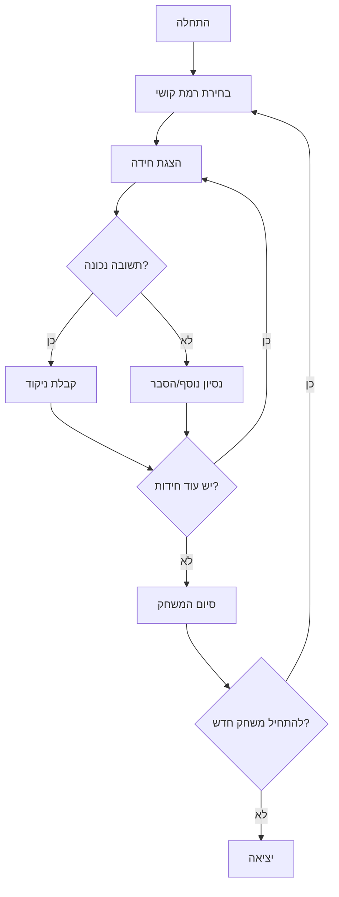

# riddles_project

משחק חידות ב-JavaScript הכולל רמות קושי שונות.

## תיאור

הפרויקט הוא משחק חידות בו המשתמש מתמודד עם שאלות (חידות) במגוון רמות קושי.
המטרה היא לענות נכון על כמה שיותר חידות, כאשר כל חידה שייכת לרמת קושי שונה (קל, בינוני, קשה וכדומה).

## תכונות עיקריות

- משחק חידות שמבוסס על JavaScript בלבד (הרצה מהטרמינל/קונסול)
- חידות במגוון רמות קושי
- אפשרות להוסיף ולהרחיב את מאגר החידות

## איך מריצים

1. יש לוודא שמותקן Node.js במחשב.
2. להריץ את הפקודה:
   ```bash
   node app.js
   ```
3. לעקוב אחר ההוראות בקונסול, לבחור רמת קושי ולענות על החידות.

## טכנולוגיות

- JavaScript (Node.js)

## תרומה

נשמח לקבל חידות חדשות, הצעות לשיפור ודיווחי באגים.

## רישיון

הפרויקט ללא רישיון רשמי בשלב זה.

---

## תרשים זרימה



## מבנה התוכנה

```
riddles_project/
│
├── main.js      # הקובץ הראשי שמריץ את המשחק, מציג את התפריטים והחידות, ומנהל את הזרימה והניקוד.
├── riddles.js   # קובץ המכיל את מאגר החידות, קלאס Riddle, פונקציות עזר, וקלאס Player.
└── README.md    # קובץ תיעוד זה.
```

### פירוט מחלקות ופונקציות עיקריות

#### Riddle (מחלקה)
מייצגת חידה יחידה.
- שדות עיקריים: טקסט החידה, תשובה, רמת קושי, הסבר.
- ask (מתודה): מציגה את החידה למשתמש ומבקשת קלט. בודקת אם התשובה נכונה (כולל ניהול נסיונות/הסבר במקרה הצורך) ומחזירה האם המשתמש ענה נכון.

#### Player (מחלקה)
מייצגת שחקן במשחק.
- שדות עיקריים: שם השחקן, ניקוד נוכחי, אולי גם היסטוריית תשובות.
- המתודות של המחלקה מאפשרות לנהל את הניקוד ואת פרטי השחקן במהלך המשחק.
