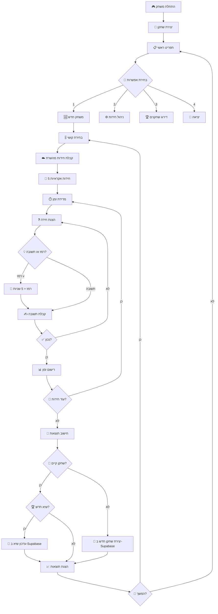

# 🧩 משחק החידות המתקדם

משחק חידות אינטראקטיבי מבוסס Node.js עם ארכיטקטורה client-server, מערכת ניהול שחקנים, וממשק CRUD מלא לניהול חידות.

## 🎯 תיאור הפרויקט

פרויקט החידות הוא משחק קונסולה מתקדם הבנוי עם JavaScript/Node.js עם הפרדה בין client ו-server. המשחק כולל:

- **🧮 חידות מתמטיות** בשלוש רמות קושי (קל, בינוני, קשה)
- **⏱️ מערכת מדידת זמן** עם עונשים ותגמולים
- **🏆 מעקב ביצועים** ושיאים אישיים
- **👥 מערכת שחקנים** עם דירוג ורשומות
- **⚙️ ממשק CRUD** לניהול חידות
- **🌐 API RESTful** עבור ניהול נתונים
- **☁️ אחסון בענן** עם MongoDB Atlas ו-Supabase

## 🏗️ ארכיטקטורה

הפרויקט מורכב משלושה חלקים עיקריים:

### 🖥️ Client Side
- **Game Manager**: ניהול המשחק והתפריטים
- **Models**: מחלקות Player ו-Riddle
- **Services**: שירותים עסקיים
- **Fetch Services**: תקשורת עם השרת

### 🌐 Server Side
- **Express Server**: שרת HTTP עם API endpoints
- **Routes**: ניתוב לחידות ושחקנים
- **Controllers**: לוגיקה עסקית
- **DAL**: שכבת גישה לנתונים

### 🗄️ Database Layer
- **MongoDB Atlas**: אחסון חידות בבסיס נתונים NoSQL
- **Supabase**: אחסון שחקנים בבסיס נתונים PostgreSQL
- **Auto-Incrementing IDs**: מערכת מונה אוטומטי לחידות חדשות

## 📁 מבנה הפרויקט

```
riddles_project/
│
├── 📂 client/                    # Client Side
│   ├── app.js                   # נקודת הכניסה
│   ├── 📂 game_manager/         # ניהול המשחק
│   │   ├── menu.js             # תפריט ראשי
│   │   ├── game.js             # לוגיקת המשחק
│   │   └── fetch.js            # תקשורת עם השרת
│   ├── 📂 models/              # מודלים
│   │   ├── player.js          # מחלקת השחקן
│   │   └── riddle.js          # מחלקת החידה
│   └── 📂 services/            # שירותים עסקיים
│       ├── createLevel.js     # יצירת רמות קושי
│       ├── createRiddle.js    # יצירת חידות
│       ├── updateRiddle.js    # עדכון חידות
│       ├── deleteRiddle.js    # מחיקת חידות
│       ├── creatPlayer.js     # יצירת שחקנים
│       ├── updateTimeToPlayer.js  # עדכון זמני שחקנים
│       ├── showAllPlayers.js  # הצגת שחקנים
│       └── menuRiddles.js     # תפריט ניהול חידות
│
├── 📂 server/                   # Server Side
│   ├── server.js               # שרת Express
│   ├── 📂 routes/              # API Routes
│   │   ├── riddles.js          # ניהול חידות
│   │   └── players.js          # ניהול שחקנים
│   ├── 📂 controllers/         # Controllers (ריקים - עתידיים)
│   ├── 📂 DAL/                 # Data Access Layer
│   │   ├── dallRiddles.js      # CRUD MongoDB לחידות
│   │   ├── dalPlayers.js       # CRUD Supabase לשחקנים
│   │   ├── read.js             # קריאת נתונים (JSON)
│   │   ├── create.js           # יצירת נתונים (JSON)
│   │   ├── update.js           # עדכון נתונים (JSON)
│   │   └── delete.js           # מחיקת נתונים (JSON)
│   └── 📂 db/                  # Database Configuration
│       ├── mongoDb.js          # חיבור ל-MongoDB
│       ├── riddle.txt          # חידות (גיבוי JSON)
│       └── playersDb.txt       # שחקנים (גיבוי JSON)
```

## 🚀 התקנה והרצה

### דרישות מקדימות
- Node.js (גרסה 16+)
- npm או yarn
- חיבור לאינטרנט עבור בסיסי הנתונים
- MongoDB Atlas Account
- Supabase Account

### התקנת חבילות
```bash
# שכפול הפרויקט
git clone <repository-url>
cd riddles_project

# התקנת תלויות עיקריות
npm install readline-sync
npm install express
npm install mongodb
npm install @supabase/supabase-js
npm install dotenv
```

### הגדרת בסיסי נתונים

#### MongoDB Atlas
1. צור חשבון ב-MongoDB Atlas
2. צור cluster חדש
3. קבל את connection string
4. עדכן בקובץ `server/db/mongoDb.js`:
```javascript
export const mongoClient = new MongoClient('your-mongodb-connection-string');
```

#### Supabase
1. צור חשבון ב-Supabase
2. צור פרויקט חדש
3. צור טבלת `players` עם השדות: `id`, `name`, `time`
4. עדכן בקובץ `server/DAL/dalPlayers.js`:
```javascript
const supabase = createClient(
    'your-supabase-url',
    'your-supabase-anon-key'
)
```

### הרצת הפרויקט
```bash
# הרצת השרת (טרמינל ראשון)
cd server
node server.js

# הרצת הקלינט (טרמינל שני)  
cd client
node app.js
```

## 🎮 איך לשחק

### 1. התחלת משחק
- בחר באפשרות "1" מהתפריט הראשי
- הזן את שמך
- בחר רמת קושי (easy/medium/hard)

### 2. רמות קושי
- **🟢 Easy**: 5 שניות לחידה
- **🟡 Medium**: 10 שניות לחידה  
- **🔴 Hard**: 20 שניות לחידה

### 3. משחק
- תוצגו 5 חידות אקראיות מהרמה שנבחרה
- הקלד תשובה או 'v' לרמז (עונש 5 שניות)
- מדידת זמן מדויקת לכל חידה
- עונש 5 שניות נוספות על איחור מהזמן המוקצב

### 4. תוצאות
- הצגת זמן כולל וממוצע
- השוואה לשיא האישי
- עדכון אוטומטי בבסיסי הנתונים

## 🔧 תכונות מתקדמות

### 📊 מערכת הניקוד
```javascript
// חישוב זמן סופי
finalTime = riddleTime + hintPenalty + timeLimitPenalty

// עונש רמז: 5 שניות לכל רמז
hintPenalty = numberOfHints * 5000

// עונש איחור: 5 שניות נוספות אם עברת את הזמן המוקצב
timeLimitPenalty = (riddleTime > timeLimit) ? 5000 : 0
```

### 🏆 מערכת שיאים
- שמירת השיא האישי הטוב ביותר ב-Supabase
- דירוג שחקנים (top 5 לפי זמן הנמוך ביותר)
- מעקב אחר סטטיסטיקות מפורטות
- עדכון אוטומטי של רשומות חדשות

### ⚙️ ממשק CRUD
- **Create**: הוספת חידות חדשות עם ID אוטומטי
- **Read**: קריאת חידות מ-MongoDB לפי רמת קושי
- **Update**: עדכון חידות קיימות
- **Delete**: מחיקת חידות

### 🆔 מערכת ID אוטומטית
- שימוש במונה אוטומטי ב-MongoDB
- כל חידה חדשה מקבלת `riddle_id` ייחודי
- אין התנגשויות או כפילויות

## 🌐 API Documentation

### Riddles Endpoints (MongoDB)
```http
GET    /riddle/getall           # קבלת כל החידות
GET    /riddle/getByLevel/:level # קבלת חידות לפי רמת קושי
POST   /riddle/create           # יצירת חידה חדשה (עם ID אוטומטי)
PUT    /riddle/update/:id       # עדכון חידה לפי riddle_id
DELETE /riddle/delete/:id       # מחיקת חידה לפי riddle_id
```

### Players Endpoints (Supabase)
```http
GET  /player/getall            # קבלת כל השחקנים
GET  /player/getByName/:name   # בדיקה אם שחקן קיים + קבלת הזמן שלו
POST /player/create            # יצירת שחקן חדש
PUT  /player/update/:name      # עדכון זמן שחקן קיים
```

## 📋 מבני נתונים

### 🧩 מבנה חידה (MongoDB)
```json
{
  "_id": "ObjectId",
  "riddle_id": 1,
  "name": "Math Easy",
  "taskDescription": "5+3",
  "correctAnswer": "8",
  "difficulty": "easy",
  "timeLimit": 5000,
  "hint": "It's an even number between 7 and 9."
}
```

### 👤 מבנה שחקן (Supabase)
```json
{
  "id": 1,
  "name": "יוסף",
  "time": 10046
}
```

### 🔢 מבנה מונה (MongoDB)
```json
{
  "_id": "687cac7422a52d221c8b84a1",
  "counter": 42
}
```

## 🎯 מחלקות עיקריות

### 🏃 מחלקת Player
```javascript
class Player {
    constructor(name)          // יוצר שחקן חדש
    recordTime(time)           // רושם זמן חידה
    showStats()               // מציג סטטיסטיקות
    getAlltime()              // מחזיר זמן כולל
    ResetArray()              // מאפס מערך זמנים
}
```

### 🧩 מחלקת Riddle
```javascript
class Riddle {
    constructor(riddleData)    // יוצר חידה
    ask()                     // מציג חידה ומקבל תשובה + רמזים
}
```

## 🔄 זרימת המשחק



## 📊 מדדי ביצועים

### ⏱️ מדידת זמן
- **דיוק**: מילישנייה
- **רמזים**: עונש 5 שניות לכל רמז
- **איחור**: עונש 5 שניות נוספות אם עברת את הזמן המוקצב

### 🏆 מערכת דירוג
- מיון לפי זמן כולל (נמוך יותר = טוב יותר)
- הצגת top 5 שחקנים
- עדכון אוטומטי של שיאים ב-Supabase
- בדיקת שחקנים קיימים לפני יצירה

## 🛠️ טכנולוgiות בשימוש

### Backend
- **Node.js + Express**: שרת REST API
- **MongoDB Atlas**: בסיס נתונים לחידות
- **Supabase (PostgreSQL)**: בסיס נתונים לשחקנים
- **ES6 Modules**: import/export syntax

### Frontend (Console)
- **readline-sync**: אינטראקציה עם המשתמש
- **fetch API**: תקשורת עם השרת
- **OOP JavaScript**: מחלקות Player ו-Riddle

### Deployment Ready
- **Cloud Databases**: MongoDB Atlas + Supabase
- **Environment Variables**: הגדרות חיבור
- **Error Handling**: טיפול בשגיאות שרת וקליינט

## 🔧 הרחבות עתידיות

### 🎨 תכונות מתוכננות
- [ ] ממשק גרафי (Web UI)
- [ ] סוגי חידות נוספים (לוגיקה, מילים, חשבון מתקדם)
- [ ] מצב multiplayer בזמן אמת
- [ ] מערכת הישגים ותגיות
- [ ] אימות משתמשים ו-JWT
- [ ] אפליקציה מובילית (React Native)
- [ ] בוט טלגרם למשחק

### 🛠️ שיפורים טכניים
- [ ] Unit Testing (Jest)
- [ ] Error Handling מתקדם
- [ ] Logging System (Winston)
- [ ] Configuration Management (.env)
- [ ] Docker Support
- [ ] CI/CD Pipeline
- [ ] Rate Limiting
- [ ] Data Validation (Joi/Zod)

## 🤝 תרומה לפרויקט

נשמח לקבל:
- 🐛 דיווחי באגים
- 💡 הצעות לתכונות חדשות
- 🧩 חידות חדשות ומעניינות
- 🔧 שיפורי קוד
- 📖 שיפורי תיעוד
- 🎨 עיצוב UI/UX

### Development Guidelines
```bash
# Fork הפרויקט
git fork <repository-url>

# יצירת branch חדש
git checkout -b feature/new-feature

# Commit + Push
git commit -m "Add new feature"
git push origin feature/new-feature

# יצירת Pull Request
```

## 🧪 Testing

```bash
# הרצת טסטים (עתידי)
npm test

# בדיקת חיבור לבסיסי נתונים
cd server && node server.js
# אמור להציג: "Connected to MongoDB" + "server listening on port 2030"
```

## 📞 תמיכה וקשר

### לבעיות טכניות:
- פתח **Issue** בגיטהאב
- צרף screenshots של שגיאות
- ציין את גרסת Node.js

### לשאלות כלליות:
- צור **Discussion** בגיטהאב
- שלח מייל למפתחים
- קרא את התיעוד המלא

## 📄 רישיון

הפרויקט זמין תחת רישיון **MIT** - ראה קובץ `LICENSE` לפרטים נוספים.

## 🏷️ Tags

`nodejs` `express` `mongodb` `supabase` `javascript` `console-game` `riddles` `education` `backend` `api` `crud` `database`

---

<div align="center">

**🎯 נוצר עם ❤️ עבור חובבי חידות ומתכנתים** 

*משחק, למד, ותשתפר! 🚀*


</div>
