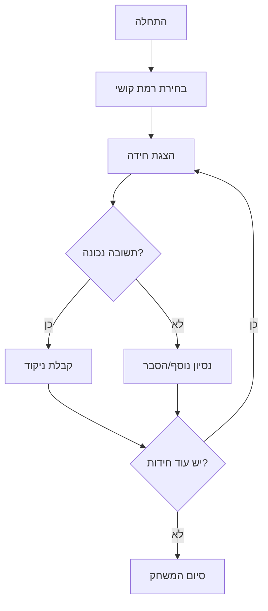

# riddles_project

משחק חידות ב-JavaScript הכולל רמות קושי שונות.

## תיאור

הפרויקט הוא משחק חידות בו המשתמש מתמודד עם שאלות (חידות) במגוון רמות קושי.
המטרה היא לענות נכון על כמה שיותר חידות, כאשר כל חידה שייכת לרמת קושי שונה (קל, בינוני, קשה וכדומה).

## תכונות עיקריות

- משחק חידות שמבוסס על JavaScript בלבד (הרצה מהטרמינל/קונסול)
- חידות במגוון רמות קושי
- אפשרות להוסיף ולהרחיב את מאגר החידות

## איך מריצים

1. יש לוודא שמותקן Node.js במחשב.
2. להריץ את הפקודה:
   ```bash
   node main.js
   ```
3. לעקוב אחר ההוראות בקונסול, לבחור רמת קושי ולענות על החידות.

## טכנולוגיות

- JavaScript (Node.js)

## תרומה

נשמח לקבל חידות חדשות, הצעות לשיפור ודיווחי באגים.

## רישיון

הפרויקט ללא רישיון רשמי בשלב זה.

---

## תרשים זרימה



## מבנה התוכנה

```
riddles_project/
│
├── main.js            # קובץ ראשי שמריץ את המשחק ומנהל את הזרימה
├── riddles.js         # מאגר החידות ופונקציות ניהול חידות
└── README.md          # קובץ תיעוד זה
```
