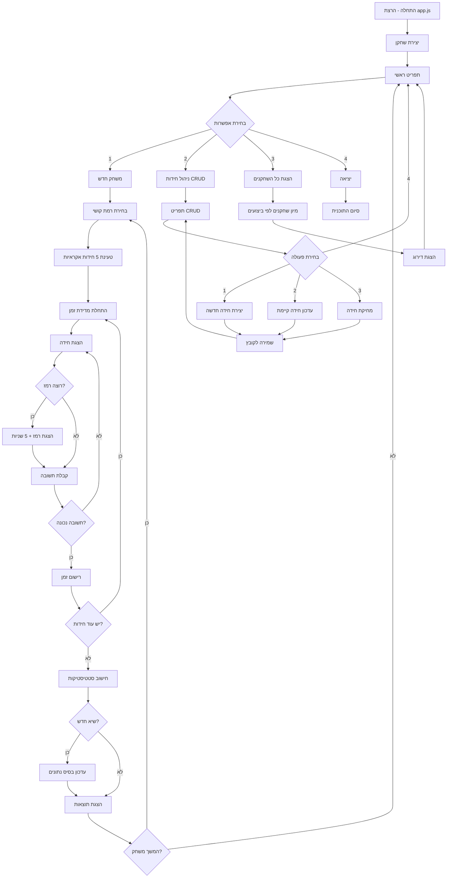

# Riddles Project - פרויקט החידות

משחק חידות אינטראקטיבי ב-JavaScript עם מערכת ניהול שחקנים ובסיס נתונים מקומי.

## תיאור הפרויקט

פרויקט החידות הוא משחק קונסולה מתקדם הכולל:
- חידות מתמטיות ברמות קושי שונות (קל, בינוני, קשה)
- מערכת ניהול שחקנים עם מעקב אחר זמנים
- מערכת CRUD לניהול חידות
- מעקב אחר שיאים אישיים
- בסיס נתונים מקומי (JSON files)

## מבנה הפרויקט

```
riddles_project/
│
├── app.js                      # נקודת הכניסה הראשית
├── package.json               # תלויות הפרויקט
├── .gitignore                 # קבצים שלא נכללים בגיט
│
├── game_manager/              # ניהול המשחק
│   ├── menu.js               # תפריט ראשי
│   └── game.js               # לוגיקת המשחק העיקרית
│
├── models/                   # מודלים של האפליקציה
│   ├── player.js            # מחלקת השחקן
│   └── riddle.js            # מחלקת החידה
│
├── services/                 # שירותים עסקיים
│   ├── createLevel.js       # יצירת רמות קושי
│   ├── createRiddle.js      # יצירת חידות חדשות
│   ├── updateRiddle.js      # עדכון חידות
│   ├── deleteRiddle.js      # מחיקת חידות
│   ├── creatPlayer.js       # יצירת שחקנים
│   ├── updateTimeToPlayer.js # עדכון זמני שחקנים
│   └── showAllPlayers.js    # הצגת כל השחקנים
│
└── DAL/                     # שכבת הנתונים
    ├── read.js             # קריאת נתונים מקבצים
    ├── create.js           # יצירת נתונים חדשים
    ├── update.js           # עדכון נתונים
    ├── dalRiddles.js       # ניהול CRUD של חידות
    ├── riddle.txt          # בסיס נתונים של חידות
    └── playersDb.txt       # בסיס נתונים של שחקנים
```

## תכונות עיקריות

### 🎮 מערכת המשחק
- **בחירת רמת קושי**: שחקנים יכולים לבחור בין קל, בינוני וקשה
- **מגבלות זמן**: כל רמת קושי עם מגבלת זמן שונה
  - קל: 5 שניות
  - בינוני: 10 שניות  
  - קשה: 20 שניות
- **מערכת רמזים**: אפשרות לקבל רמז בתוספת 5 שניות
- **עונש זמן**: עונש של 5 שניות על איחור מעבר למגבלת הזמן

### 📊 מעקב ביצועים
- **מעקב זמנים**: רישום זמני תשובה לכל חידה
- **שיאים אישיים**: מעקב אחר השיא האישי של כל שחקן
- **סטטיסטיקות**: הצגת זמן כולל וממוצע לכל משחק
- **דירוג שחקנים**: מיון שחקנים לפי ביצועים

### 🔧 ניהול תוכן
- **CRUD חידות**: יצירה, עדכון ומחיקה של חידות
- **ניהול קבצים**: שמירת נתונים בקבצי JSON
- **גיבוי אוטומטי**: עדכון אוטומטי של בסיס הנתונים

## איך להתחיל

### דרישות מקדימות
- Node.js (גרסה 14 ומעלה)
- npm או yarn

### התקנה
```bash
# שכפול הפרויקט
git clone <repository-url>
cd riddles_project

# התקנת תלויות
npm install

# הרצת המשחק
node app.js
```

## מחלקות ופונקציות מרכזיות

### 🎯 מחלקת Player
```javascript
class Player {
    constructor(name)          // יצירת שחקן חדש
    recordTime(time)           // רישום זמן חידה
    showStats()               // הצגת סטטיסטיקות
    getAlltime()              // קבלת זמן כולל
    ResetArray()              // איפוס מערך זמנים
}
```

### 🧩 מחלקת Riddle
```javascript
class Riddle {
    constructor(riddleData)    // יצירת חידה
    ask()                     // הצגת החידה וקבלת תשובה
}
```

### 🎮 פונקציות ניהול משחק
- **`menu()`**: התפריט הראשי של המשחק
- **`game(player)`**: לוגיקת המשחק העיקרית
- **`createLevel()`**: יצירת רמת קושי מבוקשת
- **`createEventToPlayer()`**: יצירת שחקן חדש

### 📁 שכבת הנתונים (DAL)
- **`read(path)`**: קריאת נתונים מקובץ JSON
- **`create(path, data, callback)`**: יצירת נתונים חדשים
- **`update(path, data, callback)`**: עדכון נתונים קיימים

## תרשים זרימה



## מבנה נתונים

### מבנה חידה
```json
{
    "id": 1,
    "name": "שם החידה",
    "taskDescription": "5+3",
    "correctAnswer": "8",
    "difficulty": "easy",
    "timeLimit": 5000,
    "hint": "זה מספר זוגי בין 7 ל-9"
}
```

### מבנה שחקן
```json
{
    "id": 1,
    "name": "שם השחקן",
    "time": 12189
}
```

## מנגנון הניקוד והזמן

1. **מדידת זמן**: המשחק מודד זמן מתחילת הצגת החידה עד התשובה הנכונה
2. **רמזים**: כל רמז מוסיף 5 שניות לזמן הכולל
3. **עונש איחור**: אם עוברים את מגבלת הזמן - עונש נוסף של 5 שניות
4. **שיאים**: השיא נמדד לפי הזמן הכולל הנמוך ביותר

## הרחבות אפשריות

- 🎨 הוספת סוגי חידות נוספים (לוגיקה, חידות מילים)
- 🌐 מעבר לבסיס נתונים אמיתי
- 📱 יצירת ממשק משתמש גרפי
- 🏆 מערכת הישגים ותגמולים
- 👥 משחק רב-משתתפים
- 📊 דוחות ואנליטיקה מתקדמת

## תרומה לפרויקט

נשמח לקבל:
- חידות חדשות ומעניינות
- הצעות לשיפור הקוד
- דיווחי באגים
- הצעות לתכונות חדשות

## רישיון

הפרויקט זמין תחת רישיון MIT.

---

**נוצר עם ❤️ בשביל אוהבי חידות וקודדים מתחילים**
