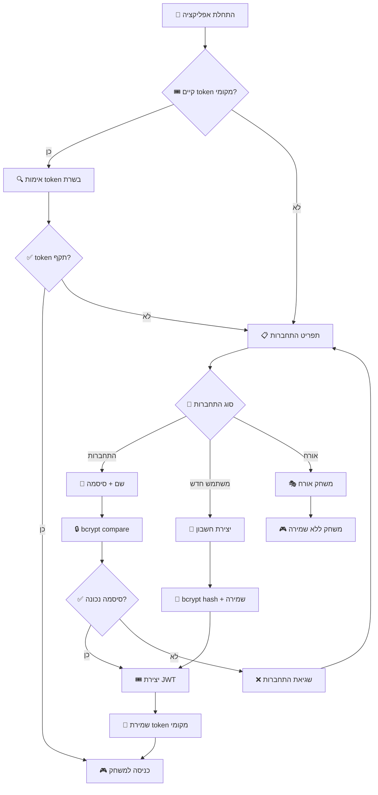

# 🧩 משחק החידות המתקדם

משחק חידות אינטראקטיבי מבוסס Node.js עם ארכיטקטורה client-server, מערכת אימות מתקדמת, ניהול שחקנים, וממשק CRUD מלא לניהול חידות.

## 🎯 תיאור הפרויקט

פרויקט החידות הוא משחק קונסולה מתקדם הבנוי עם JavaScript/Node.js עם הפרדה בין client ו-server. המשחק כולל:

- **🔐 מערכת אימות מתקדמת** עם JWT tokens ו-bcrypt הצפנה
- **👥 ניהול משתמשים** עם הרשאות (user/admin) ומערכת התחברות
- **🧮 חידות מתמטיות** בשלוש רמות קושי (קל, בינוני, קשה)
- **⏱️ מערכת מדידת זמן** עם עונשים ותגמולים
- **🏆 מעקב ביצועים** ושיאים אישיים
- **⚙️ ממשק CRUD** לניהול חידות עם הרשאות דיפרנציאליות
- **🌐 API RESTful** עבור ניהול נתונים מאובטח
- **☁️ אחסון בענן** עם MongoDB Atlas ו-Supabase

## 🏗️ ארכיטקטורה

הפרויקט מורכב משלושה חלקים עיקריים:

### 🖥️ Client Side
- **Authentication Manager**: ניהול התחברות ו-JWT tokens
- **Game Manager**: ניהול המשחק והתפריטים
- **Models**: מחלקות Player ו-Riddle
- **Services**: שירותים עסקיים עם הרשאות
- **Token Management**: שמירה וניהול אסימונים מקומית

### 🌐 Server Side
- **Express Server**: שרת HTTP עם API endpoints מאובטחים
- **JWT Authentication**: מערכת אימות עם אסימונים
- **Role-Based Access**: הרשאות משתמש/מנהל
- **Routes**: ניתוב לחידות ושחקנים עם אבטחה
- **Password Encryption**: הצפנת סיסמאות עם bcrypt
- **DAL**: שכבת גישה לנתונים

### 🗄️ Database Layer
- **MongoDB Atlas**: אחסון חידות בבסיס נתונים NoSQL
- **Supabase**: אחסון שחקנים וסיסמאות בבסיס נתונים PostgreSQL
- **Auto-Incrementing IDs**: מערכת מונה אוטומטי לחידות חדשות

## 📁 מבנה הפרויקט

```
riddles_project/
│
├── 📂 client/                    # Client Side
│   ├── app.js                   # נקודת הכניסה
│   ├── token.txt               # אחסון JWT Token מקומי
│   ├── 📂 game_manager/         # ניהול המשחק
│   │   ├── login.js            # מערכת התחברות
│   │   ├── menu.js             # תפריט ראשי עם הרשאות
│   │   ├── game.js             # לוגיקת המשחק
│   │   ├── checkToken.js       # אימות אסימונים
│   │   └── saveToken.js        # ניהול אסימונים מקומי
│   ├── 📂 models/              # מודלים
│   │   ├── player.js          # מחלקת השחקן
│   │   └── riddle.js          # מחלקת החידה
│   └── 📂 services/            # שירותים עסקיים
│       ├── 📂 servicesRiddles/  # שירותי חידות
│       │   ├── createLevel.js  # יצירת רמות קושי
│       │   ├── createRiddle.js # יצירת חידות
│       │   ├── updateRiddle.js # עדכון חידות (מנהל)
│       │   ├── deleteRiddle.js # מחיקת חידות (מנהל)
│       │   ├── getAllRiddles.js # קבלת כל החידות
│       │   ├── menuRiddlesAdmin.js # תפריט מנהל
│       │   └── menuRiddlesUser.js  # תפריט משתמש
│       └── 📂 servicesPlayers/  # שירותי שחקנים
│           ├── creatPlayer.js   # יצירת שחקנים והתחברות
│           ├── updateTimeToPlayer.js # עדכון זמני שחקנים
│           ├── showAllPlayers.js    # הצגת שחקנים
│           └── getAllPlayers.js     # קבלת כל השחקנים
│
├── 📂 server/                   # Server Side
│   ├── server.js               # שרת Express עם middleware
│   ├── .env                    # משתני סביבה (לא נכלל ב-git)
│   ├── 📂 routes/              # API Routes
│   │   ├── riddles.js          # ניהול חידות
│   │   └── players.js          # ניהול שחקנים ואימות
│   ├── 📂 controllers/         # Controllers (עתידיים)
│   ├── 📂 DAL/                 # Data Access Layer
│   │   ├── dallRiddles.js      # CRUD MongoDB לחידות
│   │   └── dalPlayers.js       # CRUD Supabase לשחקנים
│   └── 📂 db/                  # Database Configuration
│       └── mongoDb.js          # חיבור ל-MongoDB
```

## 🚀 התקנה והרצה

### דרישות מקדימות
- Node.js (גרסה 18+)
- npm או yarn
- חיבור לאינטרנט עבור בסיסי הנתונים
- MongoDB Atlas Account
- Supabase Account

### התקנת חבילות
```bash
# שכפול הפרויקט
git clone <repository-url>
cd riddles_project

# התקנת תלויות עיקריות
npm install readline-sync express mongodb @supabase/supabase-js dotenv bcrypt jsonwebtoken
```

### הגדרת בסיסי נתונים ואבטחה

#### קובץ .env (server/)
```env
# MongoDB Atlas
MONGODB_URI=your-mongodb-connection-string

# Supabase
SUPABASE_URL=your-supabase-url
SUPABASE_KEY=your-supabase-anon-key

# JWT Secret Key (חובה להיות חזק!)
SECRETE_KEY=your-very-strong-secret-key-min-256-bits
```

#### MongoDB Atlas
1. צור חשבון ב-MongoDB Atlas
2. צור cluster חדש
3. צור collection בשם `riddles`
4. צור document counter עם המבנה:
```json
{
  "_id": "687cac7422a52d221c8b84a1",
  "counter": 0
}
```

#### Supabase
1. צור חשבון ב-Supabase
2. צור פרויקט חדש
3. צור טבלת `players` עם SQL:
```sql
CREATE TABLE players (
    id SERIAL PRIMARY KEY,
    name VARCHAR(255) UNIQUE NOT NULL,
    password TEXT NOT NULL,
    role VARCHAR(50) DEFAULT 'user',
    time INTEGER
);
```

### 🔐 אבטחה והרשאות

#### יצירת JWT Secret Key חזק
```bash
# יצירת מפתח בטוח (Linux/Mac)
openssl rand -hex 32

# או ב-Node.js
node -e "console.log(require('crypto').randomBytes(32).toString('hex'))"
```

הפרויקט עוקב אחר best practices של JWT 2025 כולל מינימום 256 bits של entropy ויצירת מפתחות cryptographically secure.

### הרצת הפרויקט
```bash
# הרצת השרת (טרמינל ראשון)
cd server
node server.js

# הרצת הקלינט (טרמינל שני)  
cd client
node app.js
```

## 🔐 מערכת האימות

### 1. סוגי התחברות
- **👤 משתמש חדש**: יצירת חשבון עם סיסמה מוצפנת
- **🔑 התחברות**: אימות עם שם משתמש וסיסמה
- **🎭 אורח**: משחק ללא שמירת נתונים
- **🎟️ אסימון**: התחברות עם JWT token שמור

### 2. הרשאות משתמשים
- **👤 User**: יכול לשחק, ליצור חידות, לראות דירוג
- **👨‍💼 Admin**: כל הרשאות User + עדכון ומחיקת חידות

### 3. אבטחת סיסמאות
- **🔒 Bcrypt**: הצפנה עם 12 rounds
- **🛡️ Hash Storage**: אחסון hash בלבד, לא הסיסמה המקורית
- **✅ Secure Comparison**: השוואה מאובטחת עם bcrypt.compare

### 4. JWT Token Management
- **⏰ Expiration**: 7 שעות תוקף
- **💾 Local Storage**: שמירה מקומית בקובץ token.txt
- **🔄 Auto-Login**: התחברות אוטומטית עם token שמור
- **🚪 Logout**: מחיקת token מקומי

## 🎮 איך לשחק

### 1. התחברות למערכת
- בחר סוג התחברות מהתפריט
- הזן פרטי התחברות או צור משתמש חדש
- המערכת תשמור JWT token לשימוש עתידי

### 2. תפריט ראשי
- **🎮 משחק חדש**: התחל סיבוב חידות
- **⚙️ ניהול חידות**: יצירה/עדכון/מחיקה (לפי הרשאות)
- **🏆 דירוג שחקנים**: הצגת top 5
- **🚪 יציאה**: סיום המשחק

### 3. משחק חידות
- בחר רמת קושי (easy/medium/hard)
- פתור 5 חידות אקראיות
- השתמש ב-'v' לרמז (עונש 5 שניות)
- זמן מדיד עם עונשים על איחור

### 4. תוצאות ושיאים
- הצגת זמן כולל וממוצע
- השוואה לשיא האישי
- עדכון אוטומטי בבסיס הנתונים (רק למשתמשים רשומים)

## 🌐 API Documentation

### Authentication Endpoints
```http
POST   /player/login              # התחברות עם סיסמה
POST   /player/create             # יצירת משתמש חדש
GET    /player/token/:token       # אימות JWT token
```

### Players Endpoints (מאובטח)
```http
GET    /player/getall             # קבלת כל השחקנים
GET    /player/getByName/:name    # בדיקה אם שחקן קיים
PUT    /player/update/:name       # עדכון זמן שחקן
```

### Riddles Endpoints (הרשאות דיפרנציאליות)
```http
GET    /riddle/getall             # קבלת כל החידות (כולם)
GET    /riddle/getByLevel/:level  # קבלת חידות לפי רמה (כולם)
POST   /riddle/create             # יצירת חידה (user+admin)
PUT    /riddle/update/:id         # עדכון חידה (admin בלבד)
DELETE /riddle/delete/:id         # מחיקת חידה (admin בלבד)
```

## 📋 מבני נתונים

### 🔐 מבנה משתמש (Supabase)
```json
{
  "id": 1,
  "name": "יוסף",
  "password": "$2b$12$hashedPassword...",
  "role": "user",
  "time": 10046
}
```

### 🎟️ מבנה JWT Token
```json
{
  "role": "user",
  "name": "יוסף",
  "iat": 1753604228,
  "exp": 1753629428
}
```

### 🧩 מבנה חידה (MongoDB)
```json
{
  "_id": "ObjectId",
  "riddle_id": 1,
  "name": "Math Easy",
  "taskDescription": "5+3",
  "correctAnswer": "8",
  "difficulty": "easy",
  "timeLimit": 5000,
  "hint": "It's an even number between 7 and 9."
}
```

## 🔄 זרימת האימות



## 🛡️ תכונות אבטחה

### 🔐 הצפנת סיסמאות
- **Bcrypt**: אלגוריתם hashing מתקדם
- **Salt Rounds**: 12 rounds (מאוד בטוח)
- **No Plain Text**: אף פעם לא שומרים סיסמאות גלויות

### 🎟️ JWT Security
- **Strong Secret**: מפתח 256-bit מינימום
- **Short Expiration**: 7 שעות תוקף מקסימום
- **Secure Storage**: שמירה מקומית בקובץ מוגן
- **Token Validation**: אימות בכל בקשה רגישה

### 🚨 Error Handling
- **No Information Leakage**: הודעות שגיאה כלליות
- **Rate Limiting Ready**: מוכן לשילוב rate limiting
- **Input Validation**: בדיקת קלטים במספר שכבות

## 🎯 רמות הרשאות

### 👤 User Permissions
```javascript
// מה שמשתמש רגיל יכול לעשות:
- ✅ לשחק משחקים
- ✅ לראות דירוג
- ✅ ליצור חידות חדשות
- ✅ לראות כל החידות
- ❌ לערוך חידות קיימות
- ❌ למחוק חידות
```

### 👨‍💼 Admin Permissions
```javascript
// מה שמנהל יכול לעשות:
- ✅ כל הרשאות User
- ✅ לערוך חידות קיימות
- ✅ למחוק חידות
- ✅ ניהול מלא של המערכת
```

## 🔧 שיפורים חדשים

### 🆕 תכונות שנוספו
- [x] **מערכת אימות מלאה** עם JWT ו-bcrypt
- [x] **ניהול הרשאות** user/admin roles
- [x] **Token management** עם שמירה מקומית
- [x] **התחברות אוטומטית** עם token שמור
- [x] **הצפנת סיסמאות** עם bcrypt
- [x] **הרשאות דיפרנציאליות** בממשק CRUD
- [x] **משחק אורח** ללא צורך ברישום
- [x] **מערכת login/logout** מתקדמת

### 🛠️ שיפורים טכניים שנוספו
- [x] **Environment Variables** עם dotenv
- [x] **Password Hashing** עם bcrypt (12 rounds)
- [x] **JWT Authentication** עם expiration
- [x] **Role-Based Access Control** במסלולי API
- [x] **Error Handling** משופר עם status codes
- [x] **Token Validation** בצד הקליינט והשרת
- [x] **Secure File Storage** לאסימונים מקומיים

## 🛠️ טכנולוגיות בשימוש

### Backend
- **Node.js + Express**: שרת REST API מאובטח
- **JWT (jsonwebtoken)**: אימות ואסימונים
- **bcrypt**: הצפנת סיסמאות
- **MongoDB Atlas**: בסיס נתונים לחידות
- **Supabase (PostgreSQL)**: בסיס נתונים לשחקנים
- **dotenv**: ניהול משתני סביבה

### Security & Authentication
- **JWT Tokens**: אסימוני גישה מאובטחים
- **bcrypt Hashing**: הצפנת סיסמאות חזקה
- **Role-Based Access**: הרשאות דיפרנציאליות
- **Environment Variables**: הגנה על מפתחות רגישים

## 🔧 הרחבות עתידיות

### 🎨 תכונות מתוכננות
- [ ] **Refresh Tokens**: מערכת refresh tokens לאבטחה משופרת
- [ ] **Email Verification**: אימות מייל לחשבונות חדשים
- [ ] **Password Reset**: איפוס סיסמה עם מייל
- [ ] **Multi-Factor Authentication**: אימות דו-שלבי
- [ ] **Admin Dashboard**: ממשק ניהול מתקדם
- [ ] **User Profiles**: פרופילי משתמשים מורחבים
- [ ] **Game History**: היסטוריית משחקים מלאה
- [ ] **Social Features**: חברים והזמנות

### 🛡️ שיפורי אבטחה מתוכננים
- [ ] **Rate Limiting**: הגבלת קצב בקשות
- [ ] **Account Lockout**: נעילת חשבון אחרי נסיונות כושלים
- [ ] **Session Management**: ניהול session מתקדם
- [ ] **Audit Logging**: רישום פעולות משתמשים
- [ ] **CORS Configuration**: הגדרות CORS מתקדמות
- [ ] **Input Sanitization**: ניקוי קלטים מתקדם
- [ ] **SQL Injection Protection**: הגנה מפני הזרקת SQL

## 🧪 Testing & Security

### 🔒 בדיקות אבטחה
```bash
# בדיקת חוזק JWT secret
node -e "console.log(process.env.SECRETE_KEY?.length >= 32 ? '✅ Strong' : '❌ Weak')"

# בדיקת חיבור מאובטח לבסיסי נתונים
cd server && npm test

# בדיקת אימות endpoints
curl -X POST http://localhost:2030/player/login \
  -H "Content-Type: application/json" \
  -d '{"name":"test","password":"test"}'
```

### 🧪 Unit Tests (מתוכנן)
```bash
# טסטים לאימות
npm test auth

# טסטים לחידות
npm test riddles

# טסטים לשחקנים
npm test players
```

## 🚨 אבטחה ושמירה על פרטיות

### ⚠️ חשוב לזכור:
1. **לעולם אל תשתף את קובץ .env**
2. **השתמש במפתח JWT חזק (256+ bits)**
3. **שנה סיסמאות ברגישות**
4. **עקוב אחר לוגי השגיאות**
5. **עדכן dependencies בקביעות**

### 🔐 המלצות אבטחה נוספות:
- אל תשמור אסימונים יותר מהנדרש ואל תאחסן מידע רגיש ב-browser storage
- השתמש ב-HTTPS בפרודקשן
- הגדר CORS נכון
- הגבל גישה לבסיסי נתונים
- עקוב אחר best practices של JWT

## 📞 תמיכה וקשר

### לבעיות אבטחה:
- דווח על בעיות אבטחה בפרטיות
- השתמש בתיבת issue עם תג [SECURITY]
- ציין פרטי הגירסה ומערכת ההפעלה

### לבעיות טכניות:
- פתח **Issue** בגיטהאב
- צרף לוגי שגיאות (ללא פרטים רגישים!)
- ציין את גרסת Node.js וחבילות

## 📄 רישיון ואבטחה

הפרויקט זמין תחת רישיון **MIT** עם הסתייגויות אבטחה:

⚠️ **אחריות המפתח**: השימוש בקוד הוא באחריותך הבלעדית  
🔒 **אבטחה**: המפתחים אינם אחראיים לפרצות אבטחה בשימוש לא נכון  
📋 **Compliance**: ודא עמידה בתקנות הגנת הפרטיות המקומיות

---

<div align="center">

**🎯 נוצר עם ❤️ ו-🔒 עבור חובבי חידות ומתכנתים בטוחים** 

*שחק, למד, והישאר מוגן! 🚀*


</div>
